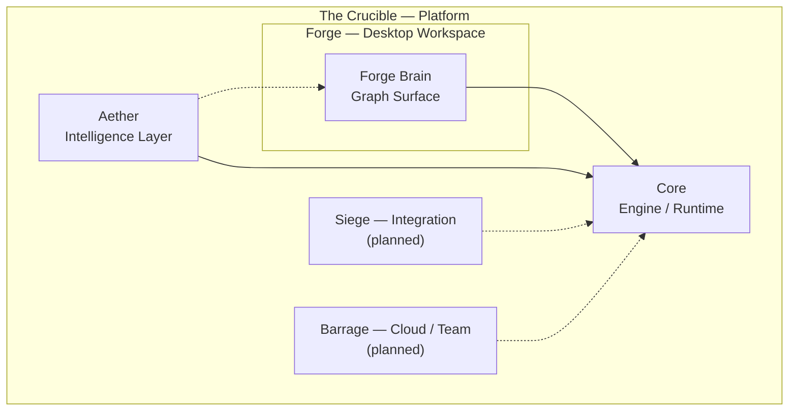
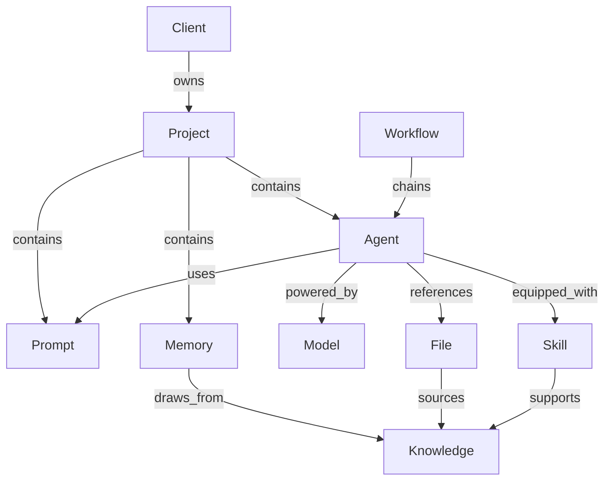

# Forge Brain

**Visual intelligence layer for The Crucible**

Forge Brain is the **early visual layer** inside [Forge](docs/vision.md) — the desktop workspace for The Crucible, a long-term AI software ecosystem built around **local-first intelligence**, **composable context**, and **disciplined API usage**.

This repository is an **early public showcase** — documentation and product positioning for a product under active development. It explains how Forge Brain will help builders visualize relationships across projects, prompts, files, agents, memories, skills, models, workflows, clients, and knowledge. There is **no interactive demo or visual media in this repo yet**; diagrams below convey the concept until assets and a prototype are ready.

---

## Accuracy Note

| | |
|---|---|
| **What this repo is** | An early public showcase — documentation, diagrams, and product positioning for Forge Brain |
| **What this repo is not** | A shipped product, production platform, interactive demo, or proprietary engine |

The production Crucible platform — including Core, Aether, and the full product stack — remains **private and under active development**. Nothing in this repository should be read as a launched product or a complete system. Capabilities described here are **directional**: prototype where noted, planned where noted, and conceptual for future ecosystem products.

---

## The Crucible Platform

**The Crucible is the platform — not a single app.** It is a long-term AI software ecosystem designed to help builders work with AI deliberately: owning their context locally, composing it across sessions, and calling external APIs only when necessary.

Three principles shape the platform:

| Principle | What it means |
|-----------|---------------|
| **Local-first intelligence** | Context, memories, and knowledge live close to the builder — not locked inside a chat window or a vendor's cloud |
| **Composable context** | Prompts, files, memories, and skills assemble into reusable bundles — not one-off paste jobs |
| **Disciplined API usage** | External model and tool calls are intentional, scoped, and traceable — reducing unnecessary token and API waste |

### Ecosystem Products

| Product | Role | Status |
|---------|------|--------|
| **The Crucible** | Umbrella platform — the ecosystem, not one application | In development |
| **Core** | Shared engine and runtime beneath all products | Private — not in this repo |
| **Forge** | Desktop workspace for daily AI builder work | In development |
| **Forge Brain** | Visual intelligence layer and graph surface inside Forge | **Prototype showcase** (this repo) |
| **Aether** | Intelligence layer — context selection and knowledge surfacing | In development |
| **Siege** | Integration platform — connecting external tools and systems | Planned |
| **Barrage** | Future cloud and team platform | Planned |

Forge Brain lives **inside Forge**. It does not replace Forge, Core, or Aether — it makes the relationships between AI assets visible and navigable.

### Ecosystem Diagram



*Solid lines: in development. Dotted lines: planned. This diagram is conceptual — not a system deployment map.*

---

## What Forge Brain Visualizes

Forge Brain maps how the entities in a builder's practice connect:

| Entity | What it represents |
|--------|-------------------|
| **Projects** | Scoped workspaces and goals |
| **Prompts** | Reusable instruction templates and variants |
| **Agents** | Configured AI workers with roles and capabilities |
| **Files** | Documents, code, and reference material |
| **Memories** | Persistent context that carries across sessions |
| **Skills** | Packaged capabilities and domain expertise |
| **Models** | LLM and tool endpoints available to the system |
| **Workflows** | Multi-step processes linking agents, prompts, and outputs |
| **Clients** | External parties, accounts, or engagement contexts |
| **Knowledge** | Structured and unstructured information assets |

Relationships are first-class — not buried in chat history or folder hierarchies. Forge Brain will make those relationships **visible**: which prompt an agent uses, which file a memory references, which client owns a project.

### Knowledge Graph Concept

The diagram below is a **conceptual example** — not a screenshot or live graph. It shows how Forge Brain will render entities and relationships on the canvas.



*Example subgraph for one project. A real builder graph may span many projects, clients, and workflows.*

---

## Why Forge Brain Exists

Modern AI work repeats the same expensive setup: re-explaining context, re-finding files, re-configuring agents, and re-pasting prompts. Forge Brain addresses that at the visual layer.

- **Reduce repeated setup** — See what already exists before rebuilding from scratch
- **Reuse composable context** — Memories, skills, and knowledge bundles travel with the work
- **Reduce unnecessary token and API waste** — Understand what context is in play before sending it
- **Preserve provenance and source references** — Trace where knowledge came from and what it connects to
- **Make large knowledge feel small in active context** — Focus on the subgraph that matters right now
- **Organize AI work visually** — See the whole practice, not just the latest chat thread

Forge Brain is for builders who treat AI as infrastructure — not a disposable conversation.

---

## Target Prototype Capabilities

Forge Brain's interactive demo is **not yet available** in this repository. The following are **planned interaction-layer capabilities** for the first public prototype — not shipped features.

| Capability | Description |
|------------|-------------|
| **Interactive graph canvas** | Explore AI assets as a connected network |
| **Zooming & panning** | Navigate large knowledge graphs |
| **Draggable nodes** | Rearrange and organize visually |
| **Relationship edges** | See how entities connect across the graph |
| **Minimap** | Orient within complex graphs at a glance |
| **Focus mode** | Isolate a subgraph for deep work |
| **Timeline mode** | View how assets and relationships evolved over time |
| **Cluster mode** | Group related entities for high-level overview |
| **Aether mode** | Preview how the intelligence layer surfaces relevant context in place |

Backend orchestration, memory systems, retrieval logic, and production integrations are **not included** in this repository. See [Architecture](docs/architecture.md) and [IP Boundary](docs/ip-boundary.md).

---

## Architecture (High Level)

Forge Brain is the graph surface inside Forge. Forge sits on Core. Ecosystem products extend the platform at different layers:

```
┌─────────────────────────────────────────────────────────┐
│              The Crucible (Platform)                    │
├─────────────────────────────────────────────────────────┤
│  Forge (Desktop Workspace)                              │
│  ┌───────────────────────────────────────────────────┐  │
│  │  Forge Brain — graph surface · modes · navigation │  │
│  └───────────────────────────────────────────────────┘  │
├─────────────────────────────────────────────────────────┤
│  Core — shared engine / runtime                         │
├──────────────┬──────────────┬───────────────────────────┤
│   Aether     │    Siege     │        Barrage            │
│ Intelligence │ Integration  │   Cloud / Team (future)   │
│    layer     │   platform   │        platform           │
└──────────────┴──────────────┴───────────────────────────┘
```

In the production platform, Forge Brain reads entity and relationship data through Forge and Core, renders it as an interactive graph, and coordinates with Aether for context surfacing. Siege and Barrage extend the ecosystem for integrations and team-scale work — both are planned, not shipped.

For more detail, see [docs/architecture.md](docs/architecture.md).

---

## Upcoming Visual Assets

**No screenshots, GIFs, or demo recordings exist yet.** Visual media will be added when the interactive prototype is ready to show. The table below lists **planned placeholder paths only** — these files are not in the repository today.

| Planned path *(not yet created)* | Intended content |
|----------------------------------|------------------|
| `assets/forge-brain-hero.png` | Full canvas overview with nodes and edges |
| `assets/forge-brain-focus.gif` | Focus mode isolating a project subgraph |
| `assets/forge-brain-timeline.gif` | Timeline mode showing relationship evolution |
| `assets/forge-brain-aether.gif` | Aether mode context overlay preview |
| `assets/forge-brain-cluster.png` | Cluster mode grouped entity view |

Until then, the mermaid diagrams in this README convey the product concept in text form.

---

## Roadmap

| Phase | Focus |
|-------|-------|
| **Alpha** *(current)* | Documentation, product positioning, conceptual diagrams — prototype in development |
| **Beta** | Demo wired to representative data; richer entity detail views |
| **Future** | Live Core integration, Siege connectors, Barrage team features |

Full roadmap: [docs/roadmap.md](docs/roadmap.md)

---

## Development Status

| Area | Status |
|------|--------|
| Forge Brain graph prototype | **In development** — not yet in this repo |
| Visual assets (screenshots, GIFs) | **Not yet created** |
| Forge desktop workspace | **In development** — private repo |
| Core engine / runtime | **In development** — private repo; not represented here |
| Aether intelligence layer | **In development** — Aether mode is a UI preview only |
| Siege integration platform | **Planned** |
| Barrage cloud / team platform | **Planned** |
| Full platform launch | **Not yet** — ecosystem is under active development |

**Maintainer:** Austin Brower  
**Program context:** Public showcase for builder program review

---

## Documentation

| Document | Description |
|----------|-------------|
| [Vision](docs/vision.md) | The Crucible platform thesis and design principles |
| [Architecture](docs/architecture.md) | High-level system design (no proprietary internals) |
| [Roadmap](docs/roadmap.md) | Alpha, Beta, and Future phases |
| [IP Boundary](docs/ip-boundary.md) | What this repo includes and what stays private |

---

## Getting Started

This repository is **documentation-only** today. There is nothing to run or install yet.

```bash
git clone https://github.com/BattleBoundBrandingGit/crucible-forge-demo.git
cd crucible-forge-demo
# Read docs/ — interactive prototype instructions will follow a future release
```

Clone the repo to read the vision, architecture, and roadmap. Watch for release tags when the first interactive prototype ships.

---

<p align="center">
  <strong>Forge Brain</strong> — See how your AI work connects. Build with clarity.
</p>
