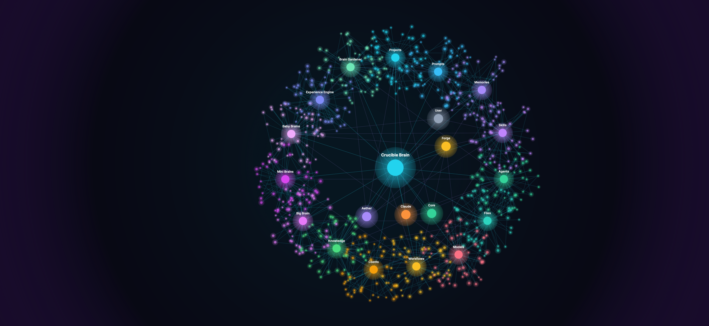
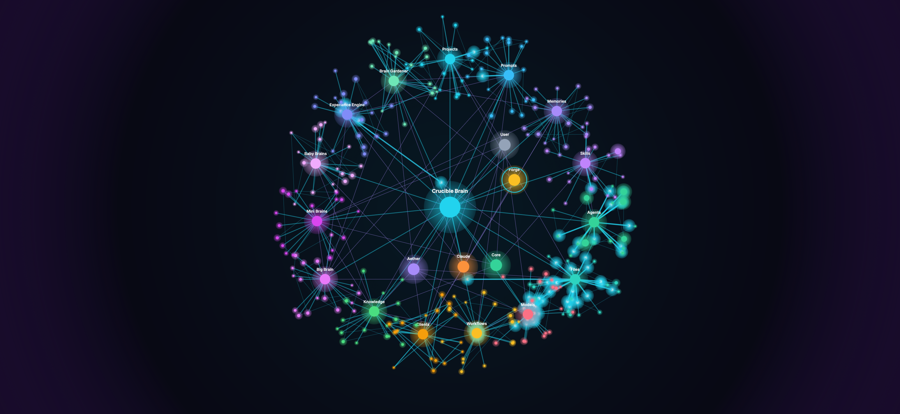
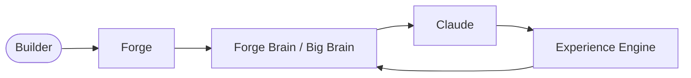

<p align="center">
  <strong style="font-size: 2em">Forge Brain</strong><br/>
  <em>Visual Intelligence Layer for<br/>The Crucible AI Knowledge Operating System</em>
</p>

<p align="center">
  <a href="demo/index.html">Try the demo</a> ·
  <a href="docs/product/The-Crucible-Product-Overview.pdf">Product overview (PDF)</a> ·
  <a href="docs/diagrams/">Diagram sources</a> ·
  <a href="docs/ip-boundary.md">Public / private boundary</a>
</p>

<p align="center">
  <sub>Early public showcase · Mock data only · Production implementation remains private</sub>
</p>

---

## Screenshots

Exported from the [interactive concept demo](demo/index.html) — Canvas graph with **mock conceptual nodes only**.

<p align="center">
  
</p>
<p align="center"><strong>Brain Map</strong> — dense interconnected knowledge graph</p>

<br/>

<table align="center">
  <tr>
    <td align="center" width="50%">
      <br/>
      <strong>Knowledge Flow</strong><br/>
      <sub>User → Forge → Brain → Claude → Experience Engine</sub>
    </td>
    <td align="center" width="50%">
      <br/>
      <strong>Signal View</strong><br/>
      <sub>Continuous pulses across the network</sub>
    </td>
  </tr>
</table>

<p align="center">
  <a href="assets/screenshots/"><strong>All screenshots</strong></a> ·
  <a href="assets/README.md">Asset guide</a>
</p>

---

## Interactive Concept Demo

**[Open `demo/index.html`](demo/index.html)** — static HTML/CSS/JS, no install, no backend.

| Feature | Description |
|---------|-------------|
| **Living knowledge graph** | 300–1,400 mock nodes · 1,000+ edges (density control) |
| **15 domain clusters** | Projects, Prompts, Memories, Skills, Agents, Files, Models, Workflows, Clients, Knowledge, Big/Mini/Baby Brains, Experience Engine, Brain Gardener |
| **Signal waves** | Click an anchor — electric pulses travel along edges |
| **Display modes** | Brain Map · Knowledge Flow · Cluster View · Signal View |
| **Controls** | Pan · Zoom · Reset view · Export PNG |

<details>
<summary><strong>Capturing screenshots</strong></summary>

1. Open the demo full-screen in Chrome or Safari.
2. Use **Medium** density (default) for the primary Brain Map shot.
3. **Reset view** before export.
4. **Export PNG** saves a 2× canvas capture — rename to match [`assets/README.md`](assets/README.md).

</details>

---

## Product Overview

| Resource | Description |
|----------|-------------|
| **[The Crucible Product Overview (PDF)](docs/product/The-Crucible-Product-Overview.pdf)** | Polished reviewer document — problem, vision, ecosystem, roadmap narrative |
| [Markdown source](docs/product/The-Crucible-Product-Overview.md) | Editable overview text |
| [Product package README](docs/product/README.md) | What the overview includes and how to regenerate the PDF |

---

## Architecture Diagrams

| Resource | Description |
|----------|-------------|
| [**Mermaid sources**](docs/diagrams/) | `ecosystem`, `platform-architecture`, `knowledge-flow`, `brain-hierarchy`, `roadmap` |
| [Embedded diagrams (Markdown)](docs/diagrams.md) | Canonical Mermaid blocks used in docs and README |
| [Application visual package](docs/visuals/claude-application/) | Annotated diagrams for builder program review |
| [Vision](docs/vision.md) · [Architecture](docs/architecture.md) · [Roadmap](docs/roadmap.md) | Supporting documentation |



*Simplified public flow — not proprietary orchestration. [Full diagram →](docs/diagrams.md#2-knowledge-flow)*

---

## Public Showcase · IP Boundary

This repository is an **early public showcase** for builder program review.

| **Included** | **Not included** |
|--------------|------------------|
| Vision, product overview PDF, conceptual diagrams | Production Core engine source |
| Static Forge Brain concept demo (mock data) | Proprietary backend or orchestration |
| Showcase screenshots and Mermaid sources | Retrieval, embeddings, ranking implementation |
| Honest roadmap and development status | Prompt compiler internals or production memory logic |

Full delineation: **[IP Boundary](docs/ip-boundary.md)**

---

## What It Is

Forge Brain is the **visual intelligence layer** inside [Forge](docs/vision.md) — where builders see how projects, prompts, memories, skills, agents, and knowledge connect across **The Crucible** AKOS.

Built on **local-first intelligence**, **composable context**, and **disciplined API usage**.

---

## Ecosystem

| Product | Role | Status |
|---------|------|--------|
| **The Crucible** | AI Knowledge Operating System | In development |
| **Core** | Shared engine / runtime | Private |
| **Forge** | Desktop workspace | In development |
| **Forge Brain** | Graph surface — **this showcase** | Early public demo |
| **Aether** | Intelligence layer | In development |
| **Siege** | Integration platform | Planned |
| **Barrage** | Cloud / team platform | Planned |

---

## Development Status

| Area | Status |
|------|--------|
| Product overview PDF | **Available** — [`docs/product/`](docs/product/) |
| Interactive concept demo | **Available** — [`demo/index.html`](demo/index.html) |
| Showcase screenshots | **Available** — [`assets/screenshots/`](assets/screenshots/) |
| Mermaid diagram sources | **Available** — [`docs/diagrams/`](docs/diagrams/) |
| Production Forge Brain canvas | **Planned** |
| Core / Forge desktop app | **In development** — private repo |

**Maintainer:** Austin Brower

---

## Documentation

| Document | Description |
|----------|-------------|
| [Product overview](docs/product/) | PDF + Markdown package |
| [Diagram sources](docs/diagrams/) | Reusable `.mermaid` files |
| [Diagrams (embedded)](docs/diagrams.md) | Canonical Markdown Mermaid |
| [Vision](docs/vision.md) | AKOS thesis |
| [Architecture](docs/architecture.md) | High-level system design |
| [Roadmap](docs/roadmap.md) | Alpha · Beta · Future |
| [IP Boundary](docs/ip-boundary.md) | Public vs. private |
| [Assets](assets/README.md) | Screenshots and media |

---

## Getting Started

```bash
git clone https://github.com/BattleBoundBrandingGit/crucible-forge-demo.git
cd crucible-forge-demo
open demo/index.html
```

1. **Read the product overview** — [PDF](docs/product/The-Crucible-Product-Overview.pdf)
2. **Try the demo** — [`demo/index.html`](demo/index.html)
3. **Browse diagrams** — [`docs/diagrams/`](docs/diagrams/)

---

<p align="center">
  <strong>Forge Brain</strong> — See how your AI work connects. Build with clarity.
</p>
