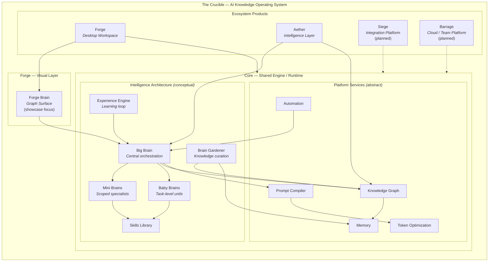
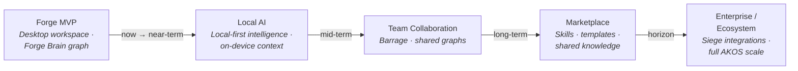
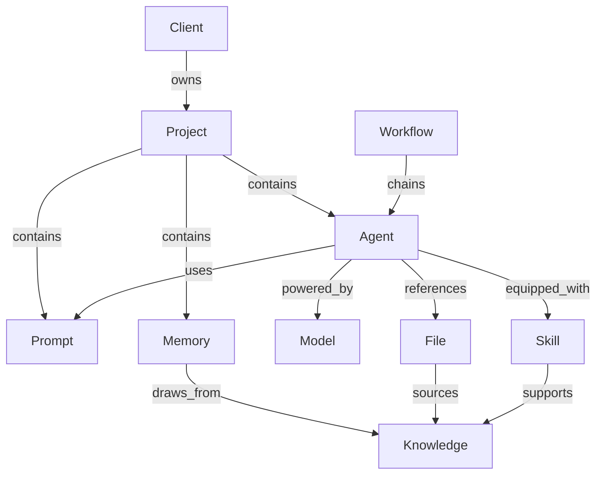

# Forge Brain

**Visual intelligence layer for The Crucible**

Forge Brain is the **early visual layer** inside [Forge](docs/vision.md) — the desktop workspace for **The Crucible**, an AI Knowledge Operating System (AKOS) built around **local-first intelligence**, **composable context**, and **disciplined API usage**.

This repository is an **early public showcase** for builder program review. It contains documentation, **conceptual Mermaid diagrams**, and a **static front-end concept demo** — not production code, not a finished product UI, and not the private engine that powers the platform.

---

## Accuracy Note

| | |
|---|---|
| **What this repo is** | Early public showcase — vision, architecture diagrams, and a static Forge Brain concept demo |
| **What this repo is not** | Production repo, shipped product, or proprietary implementation |

The production Crucible platform remains **private and under active development**. Diagrams and the concept demo are **directional** — they communicate intent, not deployed systems. See [IP Boundary](docs/ip-boundary.md).

---

## Interactive Concept Demo

A **living knowledge graph** — hundreds of interconnected mock nodes rendered on Canvas with traveling signal pulses.

**[Open `demo/index.html`](demo/index.html)**

| Feature | Description |
|---------|-------------|
| **Dense brain map** | 300–1,400 nodes · 1,000+ edges (density control) |
| **15 domain clusters** | Projects, Prompts, Memories, Skills, Agents, Files, Models, Workflows, Clients, Knowledge, Big/Mini/Baby Brains, Experience Engine, Brain Gardener |
| **Signal waves** | Click an anchor — electric pulses travel along edges |
| **Display modes** | Brain Map · Knowledge Flow · Cluster View · Signal View |
| **Navigation** | Pan (drag) · Zoom (scroll) · Reset view · Export PNG |

Mock conceptual data only — **no backend, no production graph, not proprietary.**

### Screenshots

1. Open [`demo/index.html`](demo/index.html) in Chrome or Safari (full window works best).
2. Leave **Density** on **Medium** (default) for the best balance of detail and performance.
3. Click **Reset view** to frame the graph before capturing.
4. Switch modes for different shots:
   - **Brain Map** — full dense network
   - **Knowledge Flow** — highlighted User → Forge → Brain → Claude → Experience Engine path
   - **Cluster View** — domain halos around anchor nodes
   - **Signal View** — continuous faint pulses (great for motion stills; pause by switching mode)
5. Click **Export PNG** to save the **graph canvas only** at 2× resolution (`forge-brain-{mode}-{density}-{date}.png`).
6. For a full-page screenshot (header + sidebar + graph), use the browser’s screenshot tool — Export PNG is graph-only by design.

*Entity-level Forge Brain canvas (zoom, pan, project nodes) remains in development.*

---

## The Problem

Builders repeat the same expensive AI setup every session: re-explaining context, re-finding files, re-configuring agents, re-pasting prompts, and re-paying token and API costs. There is no map of what exists or how it connects.

**The Crucible** exists to fix that — as a platform, not a chat window.

---

## System Architecture

The Crucible is an **AI Knowledge Operating System**: ecosystem products above a shared engine, with intelligence concepts and platform services at a high level.



*Conceptual diagram — not production topology. Full annotations: [docs/diagrams.md](docs/diagrams.md#1-system-architecture)*

---

## Knowledge Flow

How context composes, reaches a model, and compounds back into the brain layer.

```mermaid
flowchart LR
    user(["Builder"])
    forge["Forge<br/><i>Desktop Workspace</i>"]
    bb["Big Brain<br/><i>Orchestration</i>"]
    kg["Knowledge Graph"]
    skills["Skills Library /<br/>Mini Brains"]
    model["Claude or<br/>Other AI Model"]
    response["Better Response<br/><i>Scoped · Provenance-aware</i>"]
    ee["Experience Engine"]
    brain["Brain Layer<br/><i>Memory + Graph update</i>"]

    user -->|"intent + focus"| forge
    forge -->|"composed request"| bb
    bb -->|"resolve context"| kg
    kg -->|"relevant assets"| skills
    skills -->|"scoped prompt + context"| model
    model -->|"model output"| response
    response -->|"outcome signal"| ee
    ee -->|"learn + refine"| brain
    brain -->|"enriched knowledge"| kg
    brain -.->|"updated context"| bb
    response -->|"deliver"| forge
    forge -->|"present"| user
```



*Logical flow — not proprietary orchestration code. Details: [docs/diagrams.md](docs/diagrams.md#2-knowledge-flow)*

---

## Product Roadmap



**Current stage:** Forge MVP / early showcase. Full platform not launched. Details: [docs/roadmap.md](docs/roadmap.md) · [docs/diagrams.md](docs/diagrams.md#3-product-roadmap)

---

## Platform Principles

| Principle | What it means |
|-----------|---------------|
| **Local-first intelligence** | Context and knowledge live close to the builder — owned, not trapped in a vendor cloud |
| **Composable context** | Prompts, files, memories, and skills assemble into reusable bundles |
| **Disciplined API usage** | Model calls are scoped, intentional, and traceable — less token and API waste |

---

## Ecosystem at a Glance

| Product | Role | Status |
|---------|------|--------|
| **The Crucible** | AI Knowledge Operating System — the platform | In development |
| **Core** | Shared engine and runtime | Private — not in this repo |
| **Forge** | Desktop workspace | In development |
| **Forge Brain** | Graph surface inside Forge — **this showcase** | Early public showcase |
| **Aether** | Intelligence layer | In development |
| **Siege** | Integration platform | Planned |
| **Barrage** | Cloud / team platform | Planned |

---

## What Forge Brain Visualizes

Forge Brain maps relationships across a builder's practice — projects, prompts, files, agents, memories, skills, models, workflows, clients, and knowledge.



*Conceptual canvas view — not a screenshot. Interactive prototype planned.*

---

## Why Forge Brain Exists

- **Reduce repeated setup** — See what exists before rebuilding context
- **Reuse composable context** — Skills, memories, and bundles travel with the work
- **Reduce token and API waste** — Scope what reaches the model
- **Preserve provenance** — Trace sources and references across the graph
- **Make large knowledge feel small** — Focus on the subgraph that matters now
- **Organize AI work visually** — See the whole practice, not just the latest chat

---

## Target Prototype Capabilities

The **[concept demo](demo/index.html)** visualizes the AKOS brain network. A full **Forge Brain graph canvas** (zoom, pan, entity nodes, timeline/focus modes) is still planned:

| Capability | Status |
|------------|--------|
| Static brain network visualization | **Available** — `demo/index.html` |
| Interactive entity graph canvas | Planned |
| Zoom, pan, drag, minimap | Planned |
| Focus · Timeline · Cluster modes | Planned |
| Aether mode preview | Planned |

---

## Development Status

| Area | Status |
|------|--------|
| Architecture diagrams (Mermaid) | **Available** — conceptual only |
| Static concept demo (`demo/`) | **Available** — front-end only, mock data |
| Forge Brain graph canvas prototype | **Planned** |
| Screenshots / GIFs | **Use Export PNG** in `demo/` — graph canvas at 2× |
| Core engine / Forge desktop | **In development** — private repo |
| Full platform launch | **Not yet** |

**Maintainer:** Austin Brower

---

## Documentation

| Document | Description |
|----------|-------------|
| [Diagrams](docs/diagrams.md) | **Canonical source** for all Mermaid architecture visuals |
| [Vision](docs/vision.md) | AKOS thesis and design principles |
| [Architecture](docs/architecture.md) | High-level system design |
| [Roadmap](docs/roadmap.md) | Alpha, Beta, and Future phases |
| [IP Boundary](docs/ip-boundary.md) | Public vs. private delineation |
| [Application Visuals](docs/visuals/claude-application/) | Diagrams and one-pager for builder program review |

---

## Getting Started

```bash
git clone https://github.com/BattleBoundBrandingGit/crucible-forge-demo.git
cd crucible-forge-demo
open demo/index.html   # macOS — or open demo/index.html in any browser
```

1. **Try the concept demo** — [`demo/index.html`](demo/index.html)
2. **Read the diagrams** — [docs/diagrams.md](docs/diagrams.md)
3. **Read the vision** — [docs/vision.md](docs/vision.md)

---

<p align="center">
  <strong>Forge Brain</strong> — See how your AI work connects. Build with clarity.
</p>
