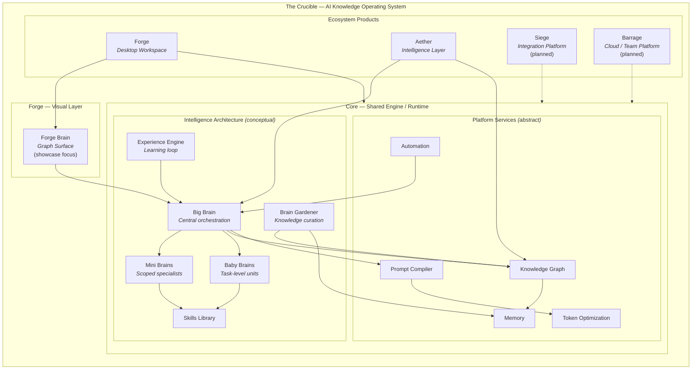

# Architecture (High Level)

Public architecture for The Crucible AI Knowledge Operating System and Forge Brain's place within it. **This is not the production repository.** Implementation details are intentionally abstracted.

> All diagrams: **[docs/diagrams.md](diagrams.md)** (canonical source)

## Design Principles

1. **AKOS, not monolith** — The Crucible is a platform ecosystem sharing a common engine
2. **Local-first** — Knowledge and context are owned close to the builder
3. **Composable context** — Assets assemble into reusable bundles
4. **Disciplined API usage** — External calls are scoped, intentional, and traceable
5. **Layered intelligence** — Big Brain, Mini Brains, and Baby Brains coordinate at different scopes
6. **Entity-relationship model** — Products share a common knowledge graph
7. **Progressive disclosure** — Large knowledge feels small in active context

## System Architecture



## Layer Descriptions

### The Crucible (AI Knowledge Operating System)

The umbrella platform — a long-term AI software ecosystem, not a single application. Coordinates ecosystem products through Core and shared principles: local-first intelligence, composable context, disciplined API usage.

### Forge (Desktop Workspace)

Primary builder-facing product. Daily AI work — projects, agents, context composition, knowledge assets. **Desktop workspace**, not a chat interface.

**Forge Brain** lives inside Forge as the graph surface for visual navigation.

### Forge Brain (Graph Surface) — *this showcase*

Visual intelligence layer within Forge. This public repo provides **documentation and diagrams only** — the interactive prototype is planned, not published here.

- Renders entity-relationship graphs on a canvas
- Navigation modes: focus, timeline, cluster, Aether preview (planned)
- Visualizes projects, prompts, files, agents, memories, skills, models, workflows, clients, knowledge

### Core (Shared Engine / Runtime) — *private*

Foundation beneath all products. **Not in this repository.**

Hosts the intelligence architecture and abstract platform services at a conceptual level:

| Concept | Public-safe role |
|---------|------------------|
| **Big Brain** | Central orchestration — routes context and coordinates specialists |
| **Mini Brains** | Scoped specialists for domains, projects, or workflows |
| **Baby Brains** | Lightweight task-level execution units |
| **Skills Library** | Reusable packaged capabilities across brain tiers |
| **Experience Engine** | Learning loop — captures outcomes, refines future context |
| **Brain Gardener** | Knowledge curation — maintains graph and memory health |
| **Knowledge Graph** | Entity-relationship store for all platform assets |
| **Memory** | Persistent context across sessions |
| **Prompt Compiler** | Assembles scoped prompts from composable context *(implementation private)* |
| **Token Optimization** | Scopes context to reduce unnecessary model input *(implementation private)* |
| **Automation** | Workflow and task execution across the platform |

### Aether (Intelligence Layer)

Cross-platform intelligence — context selection, knowledge surfacing, making large knowledge feel small in active focus. Works with Big Brain and the Knowledge Graph. Internals are proprietary.

### Siege (Integration Platform) — *planned*

Connects external tools, APIs, and systems into the Crucible entity model.

### Barrage (Cloud / Team Platform) — *planned*

Team-scale workspaces, shared graphs, collaborative context.

## Knowledge Flow

```mermaid
flowchart LR
    user(["Builder"])
    forge["Forge<br/><i>Desktop Workspace</i>"]
    bb["Big Brain<br/><i>Orchestration</i>"]
    kg["Knowledge Graph"]
    skills["Skills Library /<br/>Mini Brains"]
    model["Claude or<br/>Other AI Model"]
    response["Better Response<br/><i>Scoped · Provenance-aware</i>"]
    ee["Experience Engine"]
    brain["Brain Layer<br/><i>Memory + Graph update</i>"]

    user -->|"intent + focus"| forge
    forge -->|"composed request"| bb
    bb -->|"resolve context"| kg
    kg -->|"relevant assets"| skills
    skills -->|"scoped prompt + context"| model
    model -->|"model output"| response
    response -->|"outcome signal"| ee
    ee -->|"learn + refine"| brain
    brain -->|"enriched knowledge"| kg
    brain -.->|"updated context"| bb
    response -->|"deliver"| forge
    forge -->|"present"| user
```



This is a **logical flow** describing how the platform is designed to compound knowledge — not proprietary orchestration code.

## Entity Model (Abstract)

```
Entity Types:
  Project, Prompt, Agent, File, Memory, Skill, Model, Workflow, Client, Knowledge

Relationship Types (examples):
  Project ──contains──▶ Prompt
  Agent ──uses──▶ Prompt
  Agent ──references──▶ File
  Workflow ──chains──▶ Agent
  Memory ──belongs_to──▶ Project
  Client ──owns──▶ Project
  Knowledge ──supports──▶ Skill
  File ──sources──▶ Knowledge
```

Schema, validation, and provenance rules are proprietary. Forge Brain will render this model on the canvas when the prototype ships.

## What This Document Does Not Cover

- Core engine implementation and runtime internals
- Big Brain / Mini Brain / Baby Brain orchestration logic
- Prompt compiler, token optimization, and memory system implementation
- Embedding, indexing, and retrieval ranking
- Aether intelligence internals
- Authentication, deployment, and client-specific schemas

See [IP Boundary](ip-boundary.md).

## This Showcase

This repository contains **documentation and Mermaid diagrams only**. Production systems are developed in a separate, private repository.

## Application Visuals

Polished diagrams and a one-pager for builder program applications:

**[docs/visuals/claude-application/](visuals/claude-application/)** — ecosystem map, Core Brain Engine pipeline, knowledge flow, and reviewer one-pager.
