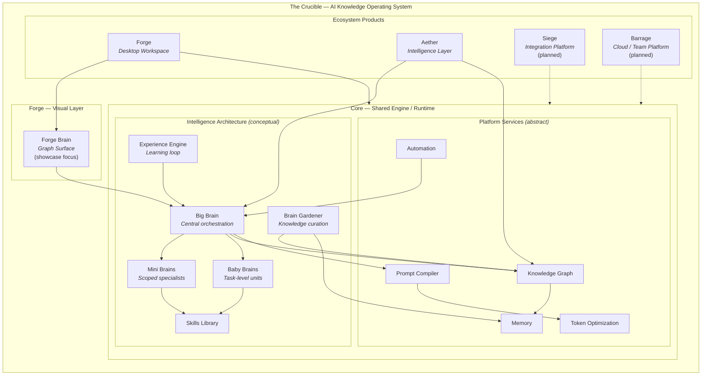
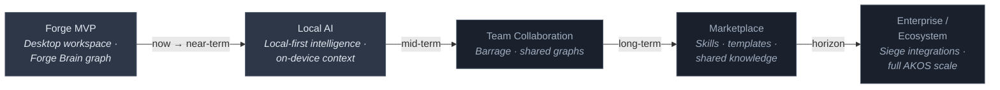
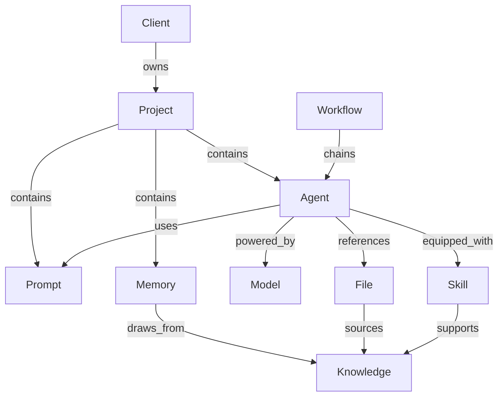

# Architecture Diagrams

Visual architecture for The Crucible and Forge Brain — rendered as Mermaid so GitHub displays them inline.

> **Early public showcase.** These diagrams are **conceptual and directional**. They describe product vision and high-level architecture only. They do not represent shipped software, production topology, or proprietary implementation. The production Crucible platform remains private and under active development.

---

## 1. System Architecture

How The Crucible fits together as an **AI Knowledge Operating System (AKOS)** — ecosystem products above a shared engine, with intelligence concepts and platform services shown at a public-safe level of abstraction.

### Reading this diagram

| Layer | Public-safe description |
|-------|-------------------------|
| **The Crucible** | Umbrella AKOS — the platform vision, not a single deployable app |
| **Forge + Forge Brain** | Where builders work daily; Forge Brain is the graph surface inside Forge |
| **Core** | Shared engine and runtime — private; not in this repository |
| **Big Brain** | Central orchestration concept — routes context, coordinates specialists |
| **Mini Brains** | Scoped intelligence units for domains, projects, or workflows |
| **Baby Brains** | Lightweight task-level units for focused execution |
| **Skills Library** | Reusable packaged capabilities available to all brain tiers |
| **Experience Engine** | Captures outcomes and feeds learning back into the system |
| **Brain Gardener** | Curates, prunes, and maintains knowledge health over time |
| **Knowledge Graph · Memory · Prompt Compiler · Token Optimization · Automation** | Abstract platform services — implementation is proprietary |
| **Aether** | Intelligence layer connecting context selection to the graph and brains |
| **Siege · Barrage** | Planned integration and team-scale products |

*Dotted lines = planned. Labels marked (abstract) or (conceptual) are not exposed implementation details.*

---

## 2. Knowledge Flow

How a builder's request moves through the system — from workspace to composed context, through AI models, and back into the knowledge layer. This is a **logical flow**, not a sequence diagram of production code.

```mermaid
flowchart LR
    user(["Builder"])
    forge["Forge<br/><i>Desktop Workspace</i>"]
    bb["Big Brain<br/><i>Orchestration</i>"]
    kg["Knowledge Graph"]
    skills["Skills Library /<br/>Mini Brains"]
    model["Claude or<br/>Other AI Model"]
    response["Better Response<br/><i>Scoped · Provenance-aware</i>"]
    ee["Experience Engine"]
    brain["Brain Layer<br/><i>Memory + Graph update</i>"]

    user -->|"intent + focus"| forge
    forge -->|"composed request"| bb
    bb -->|"resolve context"| kg
    kg -->|"relevant assets"| skills
    skills -->|"scoped prompt + context"| model
    model -->|"model output"| response
    response -->|"outcome signal"| ee
    ee -->|"learn + refine"| brain
    brain -->|"enriched knowledge"| kg
    brain -.->|"updated context"| bb
    response -->|"deliver"| forge
    forge -->|"present"| user
```

### What this flow optimizes for

- **Composable context** — Knowledge Graph and Skills/Mini Brains assemble what the model needs
- **Disciplined API usage** — Only scoped, relevant context reaches the model call
- **Provenance** — Responses carry awareness of what knowledge was in play
- **Compounding** — Experience Engine feeds outcomes back so the next request starts smarter
- **Local-first intelligence** — The brain layer and graph grow on the builder's side before and after each API call

---

## 3. Product Roadmap

Directional product evolution for The Crucible ecosystem. **Timelines are not commitments.** Current stage: early showcase and private platform development.

### Roadmap stages

| Stage | Focus | Status |
|-------|-------|--------|
| **Forge MVP** | Desktop workspace, Forge Brain graph surface, Core foundation | **In development** — this repo is the public showcase for Forge Brain |
| **Local AI** | Deeper local-first context, reduced API dependency | Planned |
| **Team Collaboration** | Shared workspaces, collaborative graphs via Barrage | Planned |
| **Marketplace** | Discoverable skills, prompts, and knowledge bundles | Planned |
| **Enterprise / Ecosystem** | Siege integrations, full platform scale | Horizon |

---

## Entity Graph (Forge Brain Canvas)

How Forge Brain visualizes relationships on the graph surface — a separate view from system architecture, focused on what builders see on the canvas.

*Example subgraph for one project. Not a screenshot — a conceptual canvas view.*

---

## 5. Interactive Concept Demo

A **static HTML companion** to the Mermaid diagrams — an explorable brain network you can open locally in any browser.

| | |
|---|---|
| **Location** | [`demo/index.html`](../demo/index.html) |
| **Stack** | HTML, CSS, JavaScript only — no build step, no backend |
| **Data** | Mock conceptual node descriptions — not production systems |
| **Purpose** | Visual communication for builder program review |

The demo shows **The Crucible Brain** at the center with orbiting concepts (Big Brain, Mini Brains, Baby Brains, Skills, Experience Engine, Brain Gardener, platform services, and ecosystem products). Hover for summaries; click to highlight relationships and read the side panel.

> **Not production.** This demo does not implement orchestration, retrieval, prompt compilation, embeddings, ranking, token optimization, or memory persistence. It is a public-safe visualization layer only.

---

## Diagram Index

| Diagram / Asset | Purpose | Also in |
|-----------------|---------|---------|
| System Architecture | Full AKOS stack — products, intelligence, services | README, `architecture.md` |
| Knowledge Flow | Request → context → model → learning loop | README, `vision.md` |
| Product Roadmap | Ecosystem evolution over time | README, `roadmap.md` |
| Entity Graph | What Forge Brain renders on canvas | README |
| Interactive Concept Demo | Explorable brain network (static HTML) | README, `demo/` |

All diagrams in this file are the **canonical source**. Other documents embed or link here.
