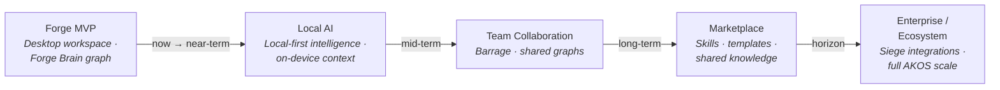

# Roadmap

Directional development trajectory for The Crucible ecosystem and Forge Brain. **The full platform is not launched.** Timelines are not commitments.

> Roadmap diagram: **[diagrams.md](diagrams.md#3-product-roadmap)** (canonical source)

---

## Product Evolution

| Stage | Focus | Status |
|-------|-------|--------|
| **Forge MVP** | Desktop workspace, Forge Brain graph, Core foundation | **Current** — public showcase for Forge Brain |
| **Local AI** | Deeper local-first context, reduced API dependency | Planned |
| **Team Collaboration** | Barrage — shared workspaces and collaborative graphs | Planned |
| **Marketplace** | Discoverable skills, prompts, knowledge bundles | Planned |
| **Enterprise / Ecosystem** | Siege integrations, full AKOS at scale | Horizon |

---

## Alpha — Current Phase

**Goal:** Credible early public showcase — vision, architecture diagrams, honest product boundaries.

### Deliverables

| Item | Status | Notes |
|------|--------|-------|
| Public showcase documentation | **Done** | Vision, architecture, roadmap, IP boundary |
| Architecture diagrams (Mermaid) | **Done** | System, knowledge flow, roadmap — [diagrams.md](diagrams.md) |
| Product positioning & accuracy note | **Done** | No overclaiming production readiness |
| Interactive graph canvas | **Planned** | First prototype not yet in this repo |
| Navigation modes | **Planned** | Focus, timeline, cluster, Aether preview |
| Screenshots / GIFs | **Planned** | Not created — Mermaid diagrams stand in for now |
| Sample graph dataset | **Planned** | Representative nodes across entity types |
| Local demo instructions | **Planned** | When interactive prototype ships |

### Alpha Success Criteria

- Reviewer understands AKOS vision and Forge Brain's role within 60 seconds
- Diagrams communicate architecture without implying shipped UI
- Product boundaries clear: platform vs. products, public vs. private
- Suitable for builder program review

---

## Beta — Next Phase

**Goal:** Interactive Forge Brain prototype with representative data and richer graph interactions.

| Area | Description |
|------|-------------|
| **Interactive graph canvas** | Nodes, edges, zoom, pan, drag on sample data |
| **Navigation modes** | Focus, timeline, cluster, Aether preview |
| **Entity detail views** | Inspect prompts, agents, files, memories from canvas |
| **Relationship exploration** | Edge types and provenance on sample graph |
| **Demo packaging** | Clone-and-run, no private system access required |

*Beta does not require live Core integration.*

---

## Future — Horizon

**Goal:** Forge Brain integrates with the production platform as the ecosystem matures.

| Area | Vision | Dependency |
|------|--------|------------|
| **Core integration** | Live entity and relationship data | Core runtime |
| **Forge desktop wiring** | Native Forge Brain panel in Forge | Forge app |
| **Local AI depth** | On-device context, reduced API calls | Core + Aether |
| **Aether live overlays** | Real intelligence-layer surfacing | Aether |
| **Barrage team views** | Shared collaborative graphs | Barrage |
| **Siege connectors** | External tools as graph nodes | Siege |
| **Marketplace** | Shared skills and knowledge bundles | Platform maturity |
| **Enterprise scale** | Full AKOS deployment patterns | All products |

---

## Platform Development (Private)

Tracked in the private production repository:

| Product / System | Stage |
|------------------|-------|
| Core engine / runtime | In development |
| Big Brain · Mini Brains · Baby Brains | In development |
| Skills Library · Experience Engine · Brain Gardener | In development |
| Knowledge Graph · Memory · Prompt Compiler · Token Optimization | In development |
| Forge desktop workspace | In development |
| Aether intelligence layer | In development |
| Siege integration platform | Planned |
| Barrage cloud / team platform | Planned |

---

## How to Follow Progress

- **This repository** — Diagram and documentation updates; prototype releases when ready
- **Release tags** — Versioned snapshots as capabilities mature

---

## Contributing

Public showcase repository. Contribution guidelines will follow the first interactive prototype release.
