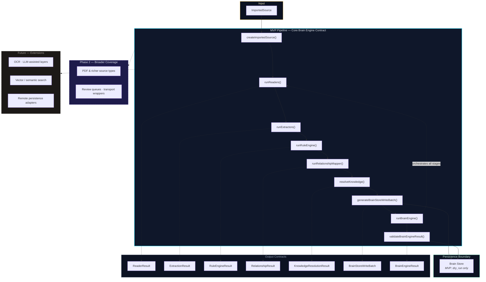

# Core Brain Engine Pipeline

> **Application visual** · Public showcase context: [architecture.md](../../architecture.md), [diagrams.md](../../diagrams.md)  
> **Private source reference** _(not in this repo)_: `spec-011-core-brain-engine-api-contract.md`  
> **Showcase note:** Contract names and stage boundaries are shown at the API level. Implementation internals remain in the private production repository.

## Diagram

## Stage Boundaries (per spec-011)

| Stage       | Scope                                                                                                                      | Notes                                                                                                                                |
| ----------- | -------------------------------------------------------------------------------------------------------------------------- | ------------------------------------------------------------------------------------------------------------------------------------ |
| **MVP**     | Full operation set: `createImportedSource` through `validateBrainEngineResult`                                             | Includes readers, extractors, **rule engine**, **relationship mapper**, knowledge resolution, and **dry-run** write-batch generation |
| **Phase 2** | Broader source types (e.g. PDF), richer relationship families, review-queue metadata, CLI/Local API/MCP transport wrappers | Builds on the same contract — does not replace MVP stages                                                                            |
| **Future**  | OCR, research importers, LLM-assisted suggestions, vector/semantic search, Supabase/remote persistence                     | Explicit extensions outside MVP contract                                                                                             |

## Pipeline Steps (Plain English)

| Step                               | What it does                                                                        |
| ---------------------------------- | ----------------------------------------------------------------------------------- |
| **ImportedSource**                 | Accepted source entering the engine — file, paste, or import bundle with provenance |
| **createImportedSource()**         | Normalizes input into canonical source with stable identity and privacy scope       |
| **runReaders()**                   | Parses source into structured segments → **ReaderResult**                           |
| **runExtractors()**                | Pulls candidate entities, tasks, decisions, requirements → **ExtractionResult**     |
| **runRuleEngine()**                | Applies deterministic classification and threshold rules → **RuleEngineResult**     |
| **runRelationshipMapper()**        | Derives graph-shaped candidate relationships → **RelationshipResult**               |
| **resolveKnowledge()**             | Compares candidates against existing knowledge → **KnowledgeResolutionResult**      |
| **generateBrainStoreWriteBatch()** | Produces dry-run write plan → **BrainStoreWriteBatch** (MVP: `dry_run` only)        |
| **runBrainEngine()**               | Orchestrates full pipeline into one result → **BrainEngineResult**                  |
| **validateBrainEngineResult()**    | Verifies contract invariants before consumers act on the result                     |

## Output Contracts

| Contract                      | Produced by                      | Contains (abstract)                                  |
| ----------------------------- | -------------------------------- | ---------------------------------------------------- |
| **ReaderResult**              | `runReaders()`                   | Normalized text, segments, warnings, source linkage  |
| **ExtractionResult**          | `runExtractors()`                | Candidate entities, tasks, decisions, evidence       |
| **RuleEngineResult**          | `runRuleEngine()`                | Rule matches, classifications, threshold summaries   |
| **RelationshipResult**        | `runRelationshipMapper()`        | Candidate nodes, edges, relationship evidence        |
| **KnowledgeResolutionResult** | `resolveKnowledge()`             | Outcomes, matches, conflicts, review recommendations |
| **BrainStoreWriteBatch**      | `generateBrainStoreWriteBatch()` | Atomic dry-run operations for Brain Store            |
| **BrainEngineResult**         | `runBrainEngine()`               | All stage outputs, summaries, warnings, validation   |

## What This Diagram Does Not Show

Per public IP boundaries, this visual does **not** include:

- Internal orchestration code or service topology
- Embedding, indexing, or retrieval ranking algorithms
- Prompt compiler or token optimization internals
- Authentication, deployment, or database schemas

See [ip-boundary.md](../../ip-boundary.md).

## Export

See [README.md](README.md#exporting-diagrams-as-images) for PNG/SVG export instructions.
