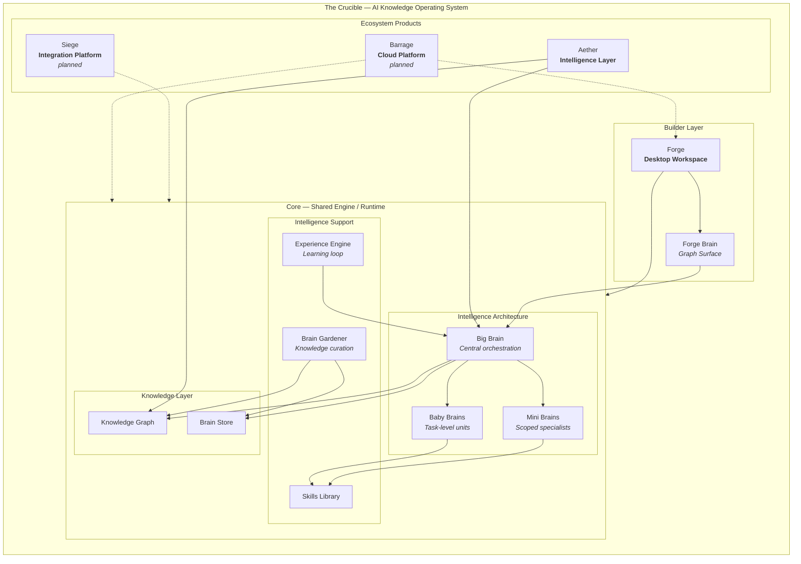

# Crucible Ecosystem Diagram

> **Application visual** · Public showcase context: [architecture.md](../../architecture.md), [vision.md](../../vision.md), [diagrams.md](../../diagrams.md#1-system-architecture)  
> **Private source reference** _(not in this repo)_: `system-map.md`  
> **Showcase note:** This is a public-safe conceptual diagram. The production platform is under active development in a private repository.

## Diagram

## Plain-English Explanation

**The Crucible** is the platform — an AI Knowledge Operating System (AKOS), not a single application. It exists so builders can own their context locally, compose it across sessions, and call external AI APIs with discipline instead of chaos.

**Core** is the shared engine and runtime beneath every product. It hosts the brain architecture (Big Brain, Mini Brains, Baby Brains), the Skills Library, Experience Engine, Brain Gardener, and the Knowledge Graph / Brain Store. Core is where imported work becomes structured, reusable intelligence.

**Forge** is the desktop workspace where builders do daily AI work. **Forge Brain** is the visual graph surface inside Forge — how builders see relationships across projects, prompts, agents, files, memories, skills, and knowledge.

**Aether** is the intelligence layer that selects and surfaces the right context for active work — making large knowledge feel small without breaking flow.

**Siege** (planned) is the integration platform — connecting external tools, APIs, and systems into the Crucible model.

**Barrage** (planned) is the cloud and team platform — shared workspaces and collaboration at scale.

The intelligence tiers work together conceptually:

| Component             | Role                                                                     |
| --------------------- | ------------------------------------------------------------------------ |
| **Big Brain**         | Central orchestration — routes context and coordinates specialists       |
| **Mini Brains**       | Scoped intelligence for projects, clients, or domains                    |
| **Baby Brains**       | Lightweight task-level units for focused execution                       |
| **Skills Library**    | Reusable packaged capabilities across all brain tiers                    |
| **Experience Engine** | Captures outcomes and refines future context                             |
| **Brain Gardener**    | Curates knowledge health — pruning, strengthening, maintaining the graph |

_Dotted lines = planned products. This diagram is conceptual — not a deployment map._

## Export

See [README.md](README.md#exporting-diagrams-as-images) for PNG/SVG export instructions.
