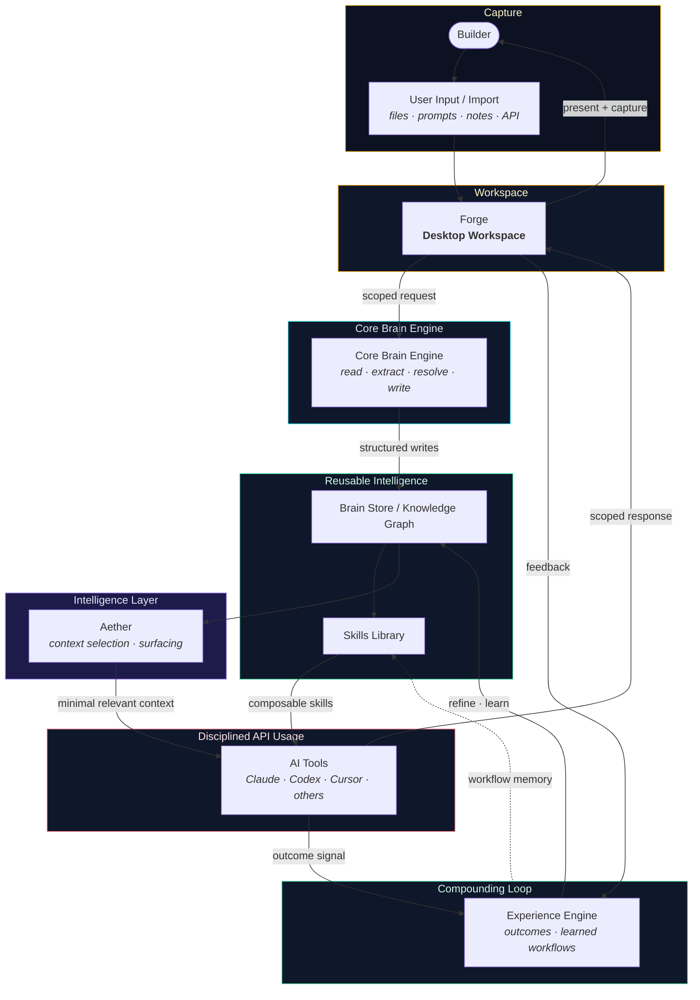

# Knowledge Flow Diagram

> **Application visual** · Public showcase context: [vision.md](../../vision.md), [architecture.md](../../architecture.md), [diagrams.md](../../diagrams.md#2-knowledge-flow)  
> **Private source reference** _(not in this repo)_: `knowledge-model.md`  
> **Showcase note:** Logical flow for application reviewers — not production orchestration code.

## Diagram

## Plain-English Explanation

This diagram shows how **builder work becomes reusable intelligence** — and how that intelligence reduces repeated setup, token waste, and API cost over time.

### 1. Capture

Builders bring work into the system through Forge — files, prompts, notes, imports, and integrations. Nothing is trapped in a disposable chat thread.

### 2. Structure (Core Brain Engine)

The **Core Brain Engine** transforms raw input into structured knowledge: read, extract, resolve against existing graph context, and write to the **Brain Store / Knowledge Graph**. Provenance travels with every asset.

### 3. Reuse (Skills Library + Aether)

The **Skills Library** holds composable capabilities. **Aether** selects only the context relevant to the current task — making large knowledge feel small in active work. Together they assemble scoped context bundles instead of re-pasting everything.

### 4. Disciplined API calls

Only the **minimal relevant context** reaches external AI tools — Claude, Codex, Cursor, and others. The builder sees what is in play before the call is made. This is the token-reduction loop: compose once, scope precisely, call intentionally.

### 5. Compounding (Experience Engine)

Responses and outcomes feed the **Experience Engine**, which refines future context, strengthens useful workflows, and writes learnings back into the Brain Store. Each session starts smarter — not longer.

## Design Outcomes

| Outcome                      | How the flow supports it                                             |
| ---------------------------- | -------------------------------------------------------------------- |
| **Token reduction**          | Aether + Skills scope context before model calls                     |
| **Reuse**                    | Brain Store and Skills Library persist across sessions               |
| **Learned workflows**        | Experience Engine captures what worked and re-applies it             |
| **Provenance**               | Core Brain Engine maintains source references through the pipeline   |
| **Local-first intelligence** | Knowledge compounds on the builder's side before and after API calls |

## Export

See [README.md](README.md#exporting-diagrams-as-images) for PNG/SVG export instructions.
